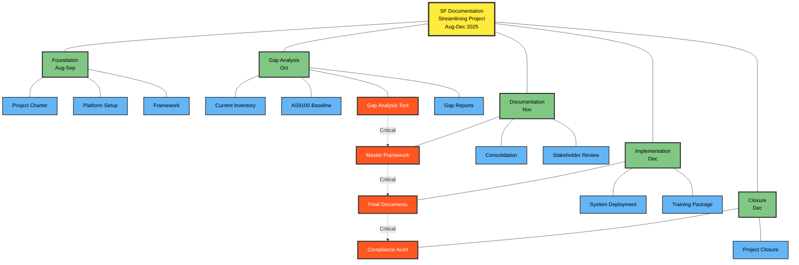

# Surface Finishing Documentation Project - Visual WBS Diagram

## Hierarchical Work Breakdown Structure Chart

```mermaid
graph TD
    A[1.0 SF Documentation<br/>Streamlining Project]
    
    A --- B[1.1 Project Foundation<br/>Deliverables]
    A --- C[1.2 Gap Analysis System<br/>& Reports]
    A --- D[1.3 Streamlined Documentation<br/>Structure]
    A --- E[1.4 Implementation &<br/>Rollout Package]
    A --- F[1.5 Project Closure &<br/>Compliance Verification]
    
    B --- B1[1.1.1 Project Charter<br/>Package]
    B --- B2[1.1.2 Platform Access &<br/>Integration Setup]
    B --- B3[1.1.3 Project Management<br/>Framework]
    
    C --- C1[1.2.1 Current State<br/>Documentation Inventory]
    C --- C2[1.2.2 AS9100 Requirements<br/>Baseline]
    C --- C3[1.2.3 Automated Gap<br/>Analysis System]
    C --- C4[1.2.4 Gap Analysis<br/>Reports Package]
    
    D --- D1[1.3.1 Master Documentation<br/>Framework]
    D --- D2[1.3.2 Document Consolidation<br/>Package]
    D --- D3[1.3.3 Stakeholder Review<br/>Package]
    
    E --- E1[1.4.1 Finalized Documentation<br/>Suite]
    E --- E2[1.4.2 System Deployment<br/>Package]
    E --- E3[1.4.3 Training & Communication<br/>Package]
    
    F --- F1[1.5.1 Compliance Audit<br/>Package]
    F --- F2[1.5.2 Project Closure<br/>Package]
    
    %% Level 4 - Key Deliverables
    B1 --- B11[1.1.1.1 Approved<br/>Project Charter]
    B1 --- B12[1.1.1.2 Stakeholder Register<br/>& RACI Matrix]
    B1 --- B13[1.1.1.3 Project Scope<br/>Statement]
    B1 --- B14[1.1.1.4 Risk Register &<br/>Mitigation Plans]
    
    C3 --- C31[1.2.3.1 Gap Analysis<br/>Software Tool]
    C3 --- C32[1.2.3.2 Automated<br/>Comparison Engine]
    C3 --- C33[1.2.3.3 Recommendation<br/>Algorithm]
    
    C4 --- C41[1.2.4.1 Executive Summary<br/>Gap Report]
    C4 --- C42[1.2.4.2 Detailed Excel<br/>Gap Analysis]
    C4 --- C43[1.2.4.3 Action Priority<br/>Matrix]
    C4 --- C44[1.2.4.4 Resource Requirement<br/>Assessment]
    
    D1 --- D11[1.3.1.1 Overarching SF<br/>QMS Document]
    D1 --- D12[1.3.1.2 Document Signpost<br/>Framework]
    D1 --- D13[1.3.1.3 AS9100-Aligned<br/>Document Hierarchy]
    D1 --- D14[1.3.1.4 Document Numbering<br/>& Naming Convention]
    
    E1 --- E11[1.4.1.1 Final Overarching<br/>SF QMS Document]
    E1 --- E12[1.4.1.2 Updated Document<br/>Repository Structure]
    E1 --- E13[1.4.1.3 Document Cross-Reference<br/>Index]
    
    F1 --- F11[1.5.1.1 AS9100 Compliance<br/>Verification Report]
    F1 --- F12[1.5.1.2 Documentation Effectiveness<br/>Assessment]
    F1 --- F13[1.5.1.3 Audit Findings &<br/>Recommendations]
    
    %% Styling
    classDef level1 fill:#ffeb3b,stroke:#333,stroke-width:3px,color:#000
    classDef level2 fill:#81c784,stroke:#333,stroke-width:2px,color:#000
    classDef level3 fill:#64b5f6,stroke:#333,stroke-width:2px,color:#000
    classDef level4 fill:#ffab91,stroke:#333,stroke-width:1px,color:#000
    
    class A level1
    class B,C,D,E,F level2
    class B1,B2,B3,C1,C2,C3,C4,D1,D2,D3,E1,E2,E3,F1,F2 level3
    class B11,B12,B13,B14,C31,C32,C33,C41,C42,C43,C44,D11,D12,D13,D14,E11,E12,E13,F11,F12,F13 level4
```

## Simplified One-Page WBS Overview

## Legend

| Color | Level | Description |
|-------|-------|-------------|
| 🟡 Yellow | Level 1 | Project |
| 🟢 Green | Level 2 | Major Deliverable Groups |
| 🔵 Blue | Level 3 | Deliverable Packages |
| 🟠 Orange | Level 4 | Specific Deliverables |
| 🔴 Red | Critical Path | Essential for project success |

## Key Critical Path Deliverables

1. **Gap Analysis Tool** (1.2.3) → Enables automation
2. **Master Framework** (1.3.1) → Core deliverable structure
3. **Final Documents** (1.4.1) → Ready for deployment
4. **Compliance Audit** (1.5.1) → Project validation

---

*This visual WBS can be rendered in Mermaid-compatible tools, exported as PNG/SVG, or printed as a one-page reference.*
